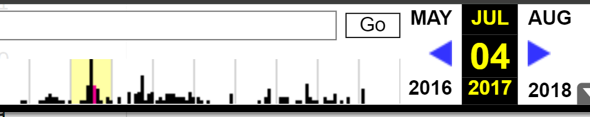

# Tests/Checks
Spot check applications data and figure out why missing values

# Scraping
## Vacancies
Internet Archive has a way of retrieving info about archives: https://github.com/internetarchive/wayback/tree/master/wayback-cdx-server

This url has federal government appointment lists, not always accurate but they can provide some snapshots: http://fja-cmf.gc.ca/appointments-nominations/judges-juges-eng.aspx

However with some significant gaps - nothing between November 15, 2020 (46 vacancies) and July 17, 2021 (33 vacancies) for example. Could choose specific ones (around year end of applications data), but misses things. e.g. 89 vacancies as of October 1, 2022, but 75 November 1, 2022
